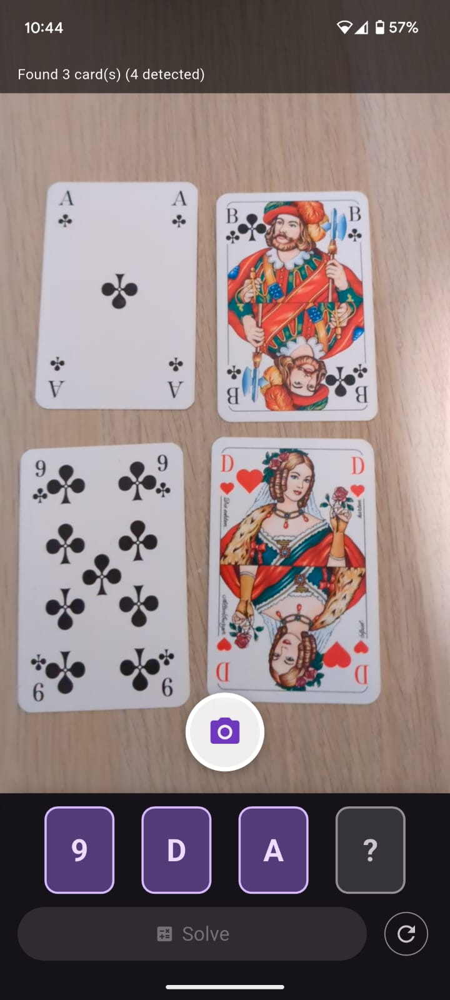
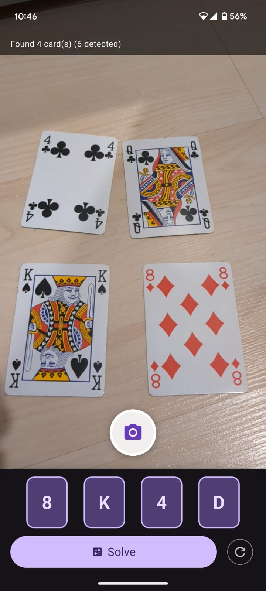

# 24 Game Solver

A 24 Game solver with **automatic card recognition** — point your phone camera at up to 4 playing cards and get all solutions instantly.

## What is the 24 Game?

Given 4 playing cards, use addition, subtraction, multiplication, and division to make the number 24. For example: `1, 6, 11, 13` → `(11 - 1 - 6) * 13 = ... ` no wait — `(13 - 11) * (6 + 1)` ... the solver will figure it out.

## Demo

| Live demo | Card recognition | Ready to solve |
|---|---|---|
|  |  |  |

## Architecture

```
Camera photo
  → [YOLOv8-nano]           detect & crop each card corner (~6 MB, FP16 TFLite)
  → [MobileNetV3-Small]     classify rank A–K per crop (~2.5 MB, FP16 TFLite)
  → card values → solver    enumerate all valid expressions → display solutions
```

Both models run **on-device** via TFLite — no internet required.

## Project Structure

```
├── main.py              # Python CLI solver (standalone, no ML)
├── game.py              # Core solver logic
├── formula.py           # Expression tree representation
├── Operations/          # +, -, *, / operator classes
├── training/
│   ├── notebooks/
│   │   ├── 01_yolo_card_detector.ipynb    # Train YOLOv8-nano card detector
│   │   └── 02_rank_classifier.ipynb       # Train MobileNetV3-Small rank classifier
│   ├── scripts/
│   │   ├── augment_and_extract.py         # Generate training crops from labeled photos
│   │   ├── test_pipeline.py               # Batch-test full ML pipeline on real photos
│   │   └── test_classifier.py             # Test classifier in isolation
│   └── data/
│       ├── photos/                        # Labeled real card photos
│       └── real_crops_v2/                 # YOLO-extracted + augmented corner crops
└── flutter_app/         # Flutter mobile app with TFLite inference
```

## ML Pipeline

The recognition pipeline uses two trained models:

| Stage | Model | Task | Input | Accuracy |
|-------|-------|------|-------|---------|
| 1 | YOLOv8-nano | Detect card corners | 320×320 | — |
| 2 | MobileNetV3-Small | Classify rank (A–K) | 128×128 crop | ~79% on real photos |

Training runs on **Google Colab** (free GPU). See the notebooks for data sources, training configs, and export steps.

**Training data:** 114 labeled real card photos → YOLO-extracted corner crops → augmented (rotation, brightness, noise) → ~5,100 crops across 13 rank classes.

## Python CLI

No Flutter needed — run the solver directly:

```bash
python main.py
```

Edit the `rounds` list in `main.py` to try different card combinations.

## Flutter App

The mobile app lives in `flutter_app/`. It uses the camera to capture cards, runs both TFLite models on-device, and displays all valid solutions.

```bash
export JAVA_HOME="/path/to/android-studio/jbr"
export ANDROID_HOME="/path/to/Android/Sdk"
export PATH="/path/to/flutter/bin:$JAVA_HOME/bin:$ANDROID_HOME/platform-tools:$PATH"

cd flutter_app
flutter run
```

Requires Flutter 3.x. For development (`flutter run`), connect an Android device with USB debugging enabled. To distribute, build a standalone APK with `flutter build apk --release`.

## Tech Stack

- **Python** — solver logic, ML training notebooks
- **YOLOv8** (Ultralytics) — card detection
- **MobileNetV3** (TensorFlow/Keras) — rank classification
- **TFLite** — on-device inference
- **Flutter** — mobile app
